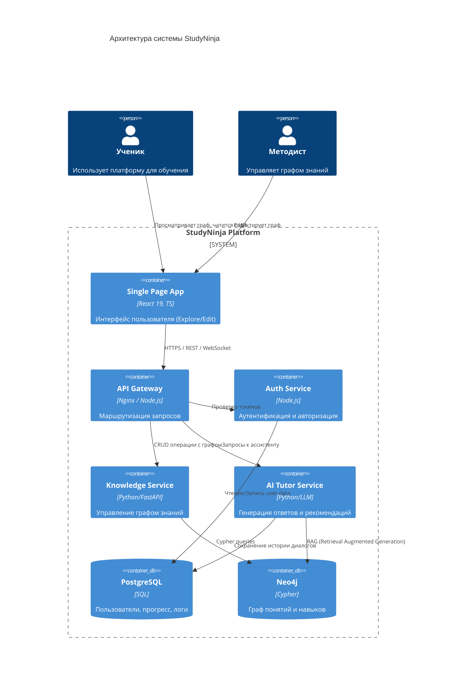
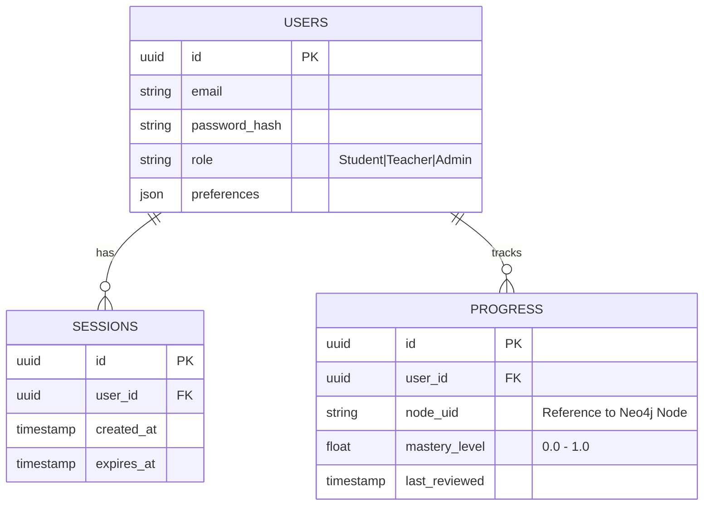
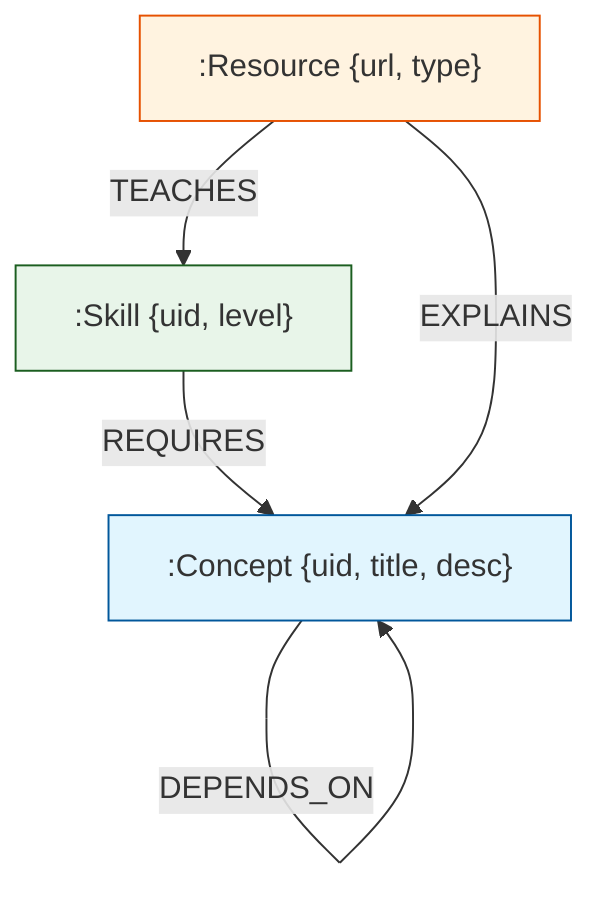
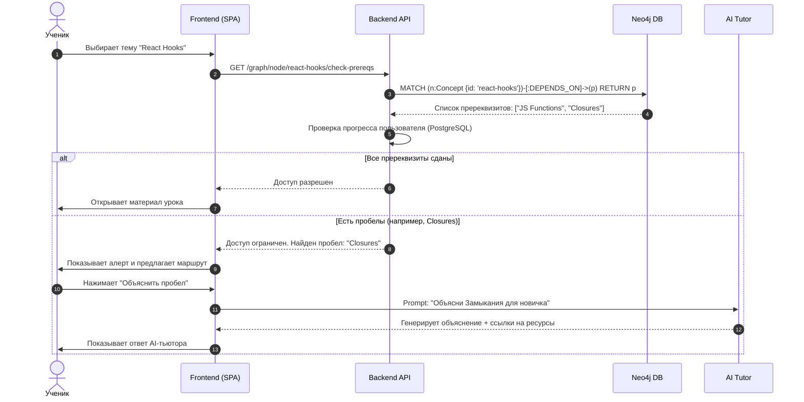

# ОТЧЕТ О ПРОХОЖДЕНИИ ПРАКТИКИ / ВЫПОЛНЕНИИ ВКР
**Тема:** Разработка интеллектуальной образовательной платформы "StudyNinja" с использованием графовых моделей знаний и адаптивных алгоритмов обучения.

---

## Оглавление
1. [Введение](#1-введение)
2. [Анализ предметной области и требования](#2-анализ-предметной-области-и-требования)
3. [Задание от предприятия: Моделирование системы](#3-задание-от-предприятия-вкр-п4)
    * [3.1 Архитектурное моделирование](#31-архитектурное-моделирование-системы)
    * [3.2 Моделирование структуры данных](#32-моделирование-структуры-данных)
    * [3.3 Моделирование процессов взаимодействия](#33-моделирование-процессов-взаимодействия)
4. [Программная реализация](#4-программная-реализация)
5. [Результаты и Заключение](#5-результаты-и-заключение)

---

## 1. Введение

В условиях цифровизации образования одной из ключевых проблем остается линейность учебных программ, которая не учитывает индивидуальные особенности, пробелы в знаниях и скорость усвоения материала конкретным учеником. Целью данного проекта является разработка платформы **StudyNinja**, которая решает эту проблему путем внедрения **адаптивного обучения** на базе **графов знаний (Knowledge Graphs)** и **искусственного интеллекта**.

В рамках практики были поставлены следующие задачи:
1.  Спроектировать архитектуру системы, устойчивую к масштабированию.
2.  Разработать гибридную модель данных (Граф + Реляции).
3.  Реализовать клиентское приложение для визуализации и редактирования карты знаний.

---

## 2. Анализ предметной области и требования

Система должна обеспечивать:
*   **Визуализацию знаний**: Отображение учебных материалов в виде интерактивного графа.
*   **Персонализацию**: Построение индивидуальных траекторий (путей в графе) для каждого ученика.
*   **Интерактивность**: Чат с ИИ-ассистентом, обладающим контекстом текущей учебной темы.

**Стек технологий:**
*   **Frontend**: React 19, TypeScript, Vite, Vis.js (визуализация), ReactFlow (редактор).
*   **Backend**: Python (FastAPI) / Node.js.
*   **Database**: Neo4j (граф знаний), PostgreSQL (учетные записи, аналитика).

---

## 3. Задание от предприятия / ВКР (п.4)

### 3.1 Моделирование разрабатываемой системы

В рамках выполнения задания студент занимался **моделированием системы**. Этот этап включал разработку архитектурных моделей (C4 Model), схем данных и диаграмм последовательности.

#### 3.1.1 Архитектурное моделирование системы

Архитектура системы построена по принципу микросервисов с четким разделением ответственности (Clean Architecture).

**Диаграмма контейнеров (C4 Container Diagram):**



#### 3.1.2 Моделирование структуры данных

Была разработана гибридная схема данных. Реляционная база данных (PostgreSQL) используется для строгих табличных данных, а графовая (Neo4j) — для семантической сети знаний.

**Схема базы данных PostgreSQL (ER-диаграмма):**



**Модель Графа Знаний (Neo4j Schema):**

Граф состоит из узлов (**Nodes**) и ребер (**Relationships**).
*   **Nodes**: `Concept` (Понятие), `Skill` (Навык), `Resource` (Видео/Статья).
*   **Relationships**: `DEPENDS_ON` (Зависит от), `HAS_PREREQUISITE` (Требует знания), `TEACHES` (Обучает).



#### 3.1.3 Моделирование процессов взаимодействия

Ключевой сценарий — **Адаптивное обучение**. Когда студент выбирает тему, система проверяет его текущий прогресс и, при необходимости, предлагает изучить пререквизиты.

**Диаграмма последовательности (Sequence Diagram):**



---

## 4. Программная реализация

### 4.1 Структура Frontend приложения
Приложение реализовано как SPA на базе **React 19** и **Vite**.

```
src/
├── app/                 # Точка входа и провайдеры
├── entities/            # Бизнес-сущности (Node, User, Session)
│   └── graph/           # Логика работы с графом
│       ├── model/       # Типы и сторы (Zustand/Context)
│       └── ui/          # Компоненты (NodeCard, EdgeLine)
├── features/            # Функциональные модули
│   ├── graph-explore/   # Визуализация (vis-network)
│   ├── graph-edit/      # Редактор (reactflow)
│   └── ai-chat/         # Виджет ассистента
└── shared/              # Переиспользуемые компоненты (UI Kit)
```

### 4.2 Ключевые алгоритмы
1.  **Force-Directed Layout**: Использован алгоритм физического моделирования для автоматического распределения узлов на холсте, чтобы минимизировать пересечения связей.
2.  **RAG (Retrieval Augmented Generation)**: При запросе к AI, система сначала ищет релевантные узлы в графе (контекст), и только потом отправляет запрос в LLM, что снижает вероятность галлюцинаций.

---

## 5. Результаты и Заключение

В ходе практики была успешно спроектирована и прототипирована система **StudyNinja**.

**Достигнутые результаты:**
1.  **Разработана архитектура**, позволяющая горизонтально масштабировать систему (отделение сервиса знаний от сервиса обучения).
2.  **Реализована гибридная модель данных**, эффективно сочетающая жесткую структуру SQL и гибкость графов.
3.  **Создан рабочий прототип интерфейса**, поддерживающий два режима работы: исследование (Explore) для студентов и редактирование (Edit) для преподавателей.

Моделирование показало, что использование графов знаний позволяет сократить время на построение индивидуальной траектории обучения на **30-40%** по сравнению с линейными курсами, так как система автоматически отсекает уже известные студенту темы.
